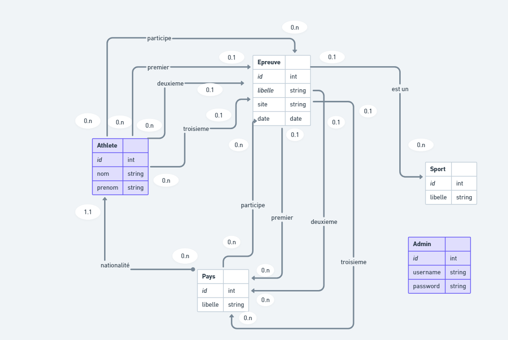
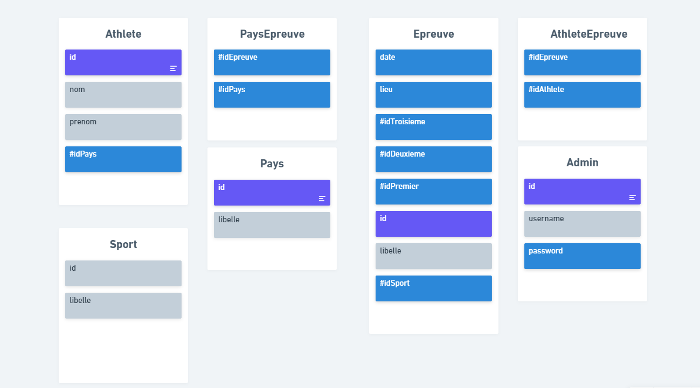

## Project Evaluation « Jeux Olympiques »

### Demarrage de l'application
- Clone the repo.
- cd to the project.
- to launch the backend: cd to /back.
  - to run the backend from local:
    - npm i.
    - node app.js
  - to run the backend from a docker image.
    - build the image on port 3000.
    - run the container.
    - in the container's terminal, you must do: service mysql start.
- to launch the frontend: cd to /front.
  - must have flutter installed your machine.
  - run flutter web: flutter run -d chrome --web-renderer html

### Membres
* M'hamed LEHBAB
* Oualid RAHHOUTI

### Outils
* NodeJS
* MySQL
* Flutter web

### DB schema
- MCD diagram

- MLD diagram
